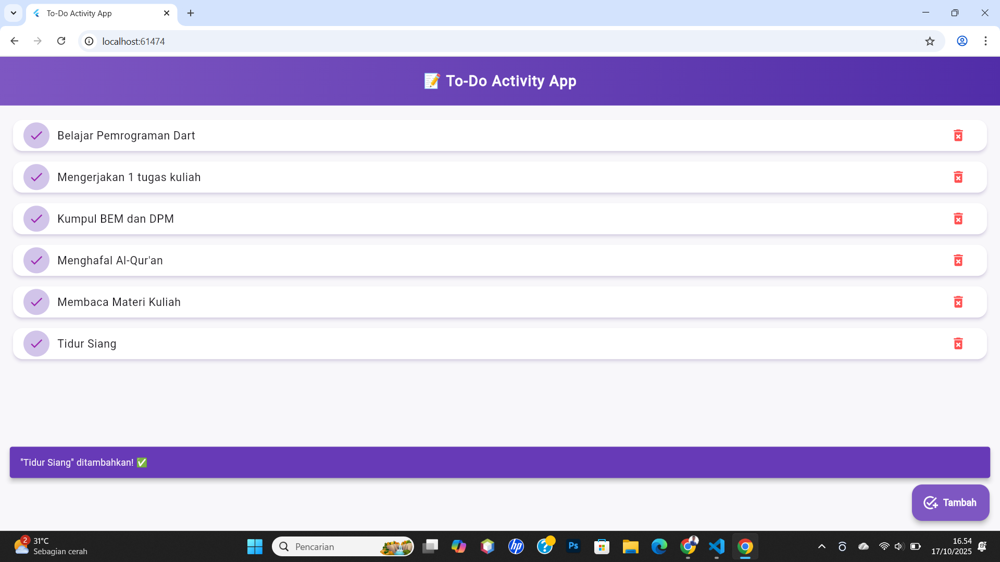
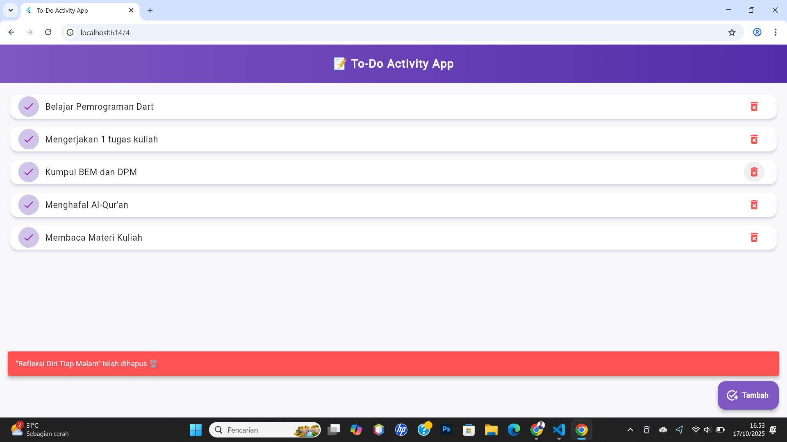

# 📝 To-Do Activity App

## 👥 Anggota Tim
| Nama Lengkap | NIM |
|---------------|-----|
| Achmad Varis Abdussalam | 2310130001 |
| Nabiel Syarof Azzaky | 2310130012 |
| Muhammad Naufal Ammr Dzakwan | 2310130010 |
| Muhammad Irfan Janur | 2310130009 |

---

## 🎯 Tema Aplikasi
**To-Do Activity App** — Aplikasi sederhana untuk mencatat dan mengelola daftar kegiatan harian pengguna.

---

## 📋 Deskripsi Singkat
Aplikasi ini digunakan untuk mencatat aktivitas harian pengguna seperti *Belajar Flutter, Olahraga, Baca Buku,* dan lain-lain.  
Pengguna dapat **menambah** dan **menghapus** aktivitas secara interaktif melalui tampilan yang sederhana dan responsif.  
Data disimpan sementara di dalam memori menggunakan struktur **List di Dart**, sehingga setiap perubahan langsung diperbarui di layar.

---

## 👩‍💻 Pembagian Tugas
| Anggota | Tugas Utama |
|----------|--------------|
| **Achmad Varis Abdussalam** | Membuat tampilan daftar kegiatan, animasi item, dan tombol tambah (FloatingActionButton). |
| **Nabiel Syarof Azzaky** | Mendesain struktur kode utama, pengaturan layout, dan tampilan antarmuka aplikasi. |
| **Muhammad Naufal Ammr Dzakwan** | Mengembangkan logika input dan fungsi dialog tambah kegiatan (`_showAddDialog()`). |
| **Muhammad Irfan Janur** | Menangani fitur penghapusan data, pengujian fungsi aplikasi, serta pembuatan dokumentasi. |

---

## 🖼️ Screenshot
1. Tampilan utama daftar kegiatan  
2. Dialog untuk menambah kegiatan baru  

### 🏠 Halaman Utama

### ➕ Tambah Item

---

## 💡 Penjelasan Teknis
Data kegiatan dalam aplikasi ini disimpan menggunakan struktur data List dari bahasa pemrograman Dart.
List ini berfungsi seperti array dinamis, yang bisa menampung beberapa data sekaligus dan berubah ukurannya secara otomatis saat user menambah atau menghapus item.

Kode dasarnya seperti berikut:

List<String> _activities = [];

Penjelasan:

List<String> artinya daftar yang hanya berisi data teks (String).
Contohnya: "Membaca Al-Qur'an, Mengerjakan Tugas, dan Kumpul BEM dan DPM".

_activities adalah variabel privat, ditandai dengan tanda _ (underscore) di depannya.
Ini berarti data hanya bisa diakses dari dalam file yang sama — menjaga keamanan dan kerapian kode.

Saat user menambah kegiatan baru melalui tombol tambah ➕, data akan dimasukkan ke list ini dengan perintah seperti:

_activities.add('Belajar Flutter');

Ketika user menghapus kegiatan, item tersebut akan dihapus dari list dengan:

_activities.removeAt(index);

Karena list disimpan di memori sementara (bukan di database), data akan hilang saat aplikasi ditutup.
Solusi ke depannya bisa menggunakan SharedPreferences atau SQLite untuk penyimpanan permanen.